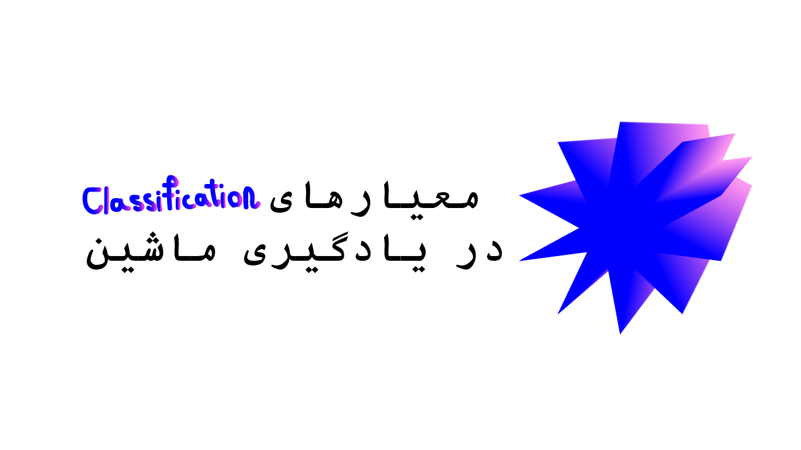
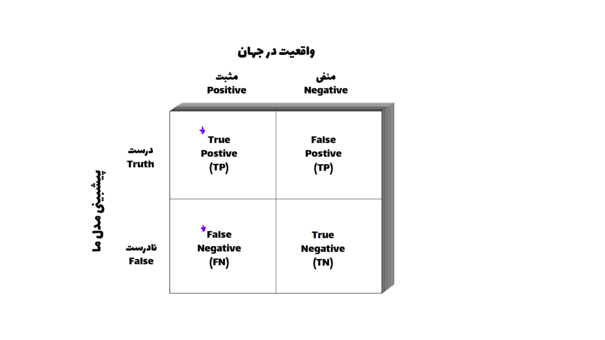
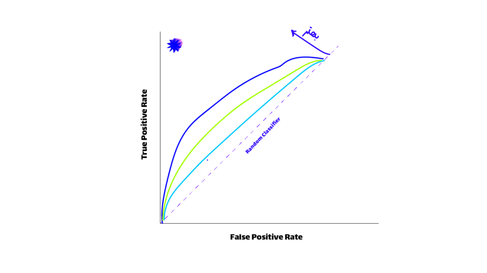

## Confusion Matrix:

در مسائل classification ما معیارهای متفاوتی برای ارزیابی مدل خودمون داریم که به گونه های مختلف قابل ارزیابی است قبل اینکه وارد خود معیارهای شویم باید با یک موضوعی به نام confusion Matrix آشنا شویم، این ماتریس مدل ما را به این صورت ارزیابی می کند.

این ماتریس که سطرهای آن نشان دهنده عملکرد مدل ما است و ستون های آن نشان دهنده واقعیت موجود در جهان است.  
برای جا افتادن در ذهن اینطوری میتوان به خاطر سپرد که اول از همه واقعیت جهان را داریم و بعد از آن چیزی که مدل ما پیشبینی کرده است را نیز بررسی می کنیم و تعداد هر کدوم را در جایگاه خودش می نویسیم.

شاید با یک مثال بشود بهتر این موضوع را بیان کرد تصور کنید میخواهیم که مدلی داشته باشیم که بتواند سنگ های دارای الماس را از غیر الماس تشخیص دهد.

اگر آن سنگ واقعا دارای الماس باشد و مدل ما هم نیز بتواند این موضوع را بفهمد به این شرایط TP (True Positive) گفته می شود که هم مدل ما درست پیشبینی کرده است (True) و هم در جهان واقعی نیز این موضوع درست است (Positive).

حالا اگر, نه در واقعیت آن سنگ دارای الماس باشد و هم مدل ما نیز این موضوع تشخیص دهد(به معنای این است که مدل ما درست پیشبینی کرده است *یعنی الماس نبودن آن سنگ* ) به این شرایط FN گفته می شود که هم مدل ما گفته این سنگ دارای الماس نیست (False) و هم سنگ ما در جهان واقعی نیز دارای الماس نیست (Negative).

*این دو شرایط بالایی که بیان شد زمانی است که مدل ما وجود یا عدم وجود الماس را درست پیشبینی کرده است.*

حالا می پردازیم به زمانی که مدل ما اشتباه پیشبینی می کند. که خطاهای نوع اول و دوم نیز از اینجا می آیند.

حالا تصور کنیم که می دانیم از جهان واقعی که یک سنگی که ما داریم حتما دارای الماس است (Postive) ولی مدل ما متوجه این موضوع نمی شود (False) (این یعنی پول از دست رفته یا FP یا خطای نوع اول).

برعکس این موضوع نیز وجود دارد، یعنی ما به یقین می دانیم که این سنگ بی ارزشی است (Negative)، ولی مدل ما به اشتباه برداشت می کند که این سنگ دارای الماس است (True) (این یعنی هدر رفتن زمان یا TN یا خطای نوع دوم).

**چون ما انسان ها برای پول و زمان ارزش قائل هستیم، سعی در کم کردن و مینیمال کردن این دو معیار داریم.**

## Accuracy:

حالا براساس این اعداد ما یک سری معیارهای کلی تری را با جمع و تقسیم این اعداد نسبت به هم به دست می آوریم اولین آنها Accuracy است.

Accuracy=TP+TNTP+TN+FP+FNAccuracy = \frac{TP+TN}{TP+TN+FP+FN}

که از جمع زمانی که مدل ما سنگ را الماس دار تشخیص میدهد (حتی به غلط) به دست می آید و آن عدد را تقسیم بر کل اعدادی که داریم می کنیم.

### مشکل Accuracy:

این معیار، مشکلی مهمی به نام imbalanced data را نمی توان کنترل کند به عنوان مثال اگر ۱۰۰ سنگ داشته باشیم که ۹۵ تا از آنها دارای الماس نباشند و مدل ما **فقط** بگویید که سنگ ماالماس ندارند یک accuracy خیلی بالایی را بدست می آوریم با اینکه مدل ما اصلا کارا و مفید نیست.

## Specificity:

معیار بعدی به نام Specificity است که فقط تشکیل شده از این است که مدل ما **درست** عمل کرده باشد یعنی اینکه زمانی که سنگ الماس داشته باشد بگوید که الماس وجود دارد و زمانی که الماس وجود نداشته باشد بگوید که الماس وجود ندارد.

Specificity=TNTN+FPSpecificity = \frac{TN}{TN+FP}

## Precision:

معیار بعدی ما به نام Precision هست که فقط به زمانی اشاره دارد که سنگ ما **دارای الماس باشد** و نحوه عملکرد مدل ما را مورد سنجش قرار می دهد.

در صورت زمانی که مدل درست پیشبینی کرده است را قرار می دهیم و در مخرج جمع زمانی که درست پیشبینی کرده است و یا غلط پیشبینی کرده است. *(به معنای اینکه الماس وجود داشت و آن را توانست پیشبینی کند و الماس وجود داشت و نتوانست آن را پیشبینی کند)*

Precision=TPTP+FPPrecision = \frac{TP}{TP+FP}

## Recall:

معیار بعدی ما به نام Recall هست فقط زمانی که مدل درست کار کرده باشند را مورد سنجش قرار می دهند.

زمانی که الماس باشد بگوید الماس دارد و زمانی که الماس نداشته باشد بگوید الماس ندارد.

Recall=TPTP+FNRecall = \frac{TP}{TP+FN}

## F1-Score:

معیار بعدی به نام F1-score هست که در داده هایی استفاده می شود که فیچر تارگت Imbalanced یا نامتوازن هستند این معیار یک تعادلی بین Recall و Precision ایجاد میکند.

F1=2×(Precision×Recall)Precision×RecallF1 = \frac{2 \times (Precision \times Recall)}{Precision \times Recall}

## AUC & ROC Curve:

یک نمودار مهمی که ما از آن برای استفاده در ارزیابی مدل های کلسیفیکشن استفاده می کنیم نمودار AUC و ROC است که هر جه این نمودار به سمت ۱ حرکت کند نشان می دهد که آن مدل ما بهتر توانسته است که کلاس ها را تشخیص دهد و آنها را جدا کند.

نمودار ROC یا(Receiver-operating characteristic) نشان دهنده عملکرد مدل ما در threshold ها مختلف هست و به ما کمک می کند که بهترین threshold را پیدا کنیم.

### threshold چیست؟

زمانی که در مسائل classification کار می کنیم نیاز هست که بر اساس احتمالات دیتای خودمان را کلاس بندی کنیم و باید یک آستانه ای را برای احتمال هر کلاس تعریف کنیم.

به عنوان مثال در مسئله classification الماس بودن سنگ مدل ما با احتمال ۰.۹۵ می گوید که یک سنگ دارای الماس است پس آن را در کلاس الماس دارها قرار می دهیم حالا برای یک سنگ دیگر می گوید که با احتمال ۰.۳ این سنگ دارای الماس هست و **تصمیم** میگیریم که این سنگ را در کلاس سنگ های معمولی قرار دهیم.

حالا شاید برای شما سوال شده باشد که چطور این تصمیم گیری انجام می شود اینجاست که threshold یا آستانه به کمک ما می آید، فرض کنید (که در بیشتر مواقع همینطور است) که آستانه ما ۰.۵ باشد یعنی اینکه اگر احتمال وجود الماس بیشتر ۰.۵ باشد در کلاس الماس دارها قرار میگیرد و اگر کمتر از ۰.۵ باشد در کلاس سنگ های معمولی قرار خواهد گرفت.

این نمودار به ما عملکرد مدل را در آستانه ها یا threshold های مختلف به ما نشان می دهد و میتوانیم که cut-off خوب برای مدل خودمان پیدا کنیم.

دومین موضوع AUC یا Area under the curve است، که هرچه AUC نزدیک تر به یک باشد به نشان می دهد که مدل ما دارد خوب کار میکند و کلاس ها را به خوبی تشخیص میدهد.

زمان استفاده هر کدام از این معیارها, به مسئله ای که باهاش دست و پنجه نرم می کنیم وابسته هست به همین دلیل به جای حفظ کردن فرمولها, باید بدانیم که کجا از کدام فرمول استفاده کنیم.
