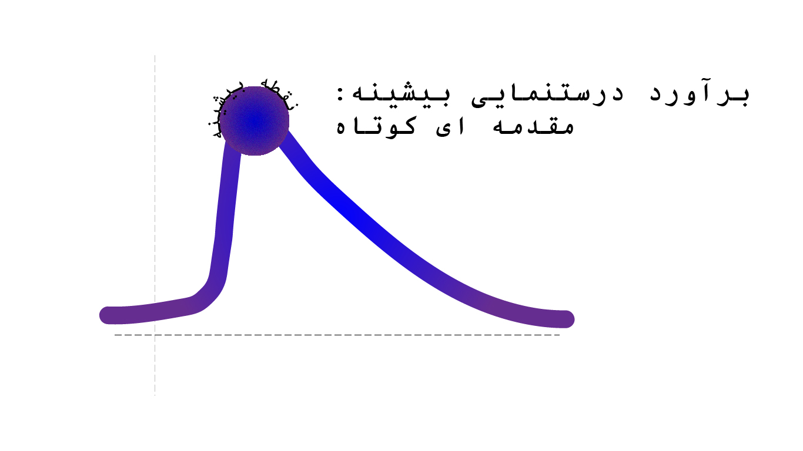
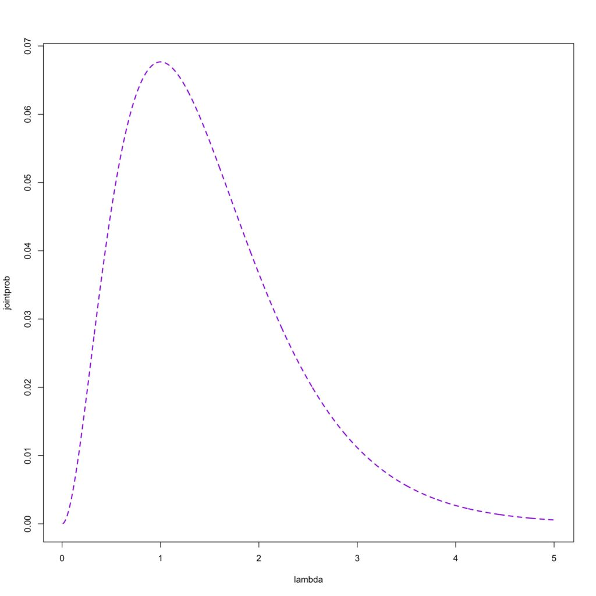
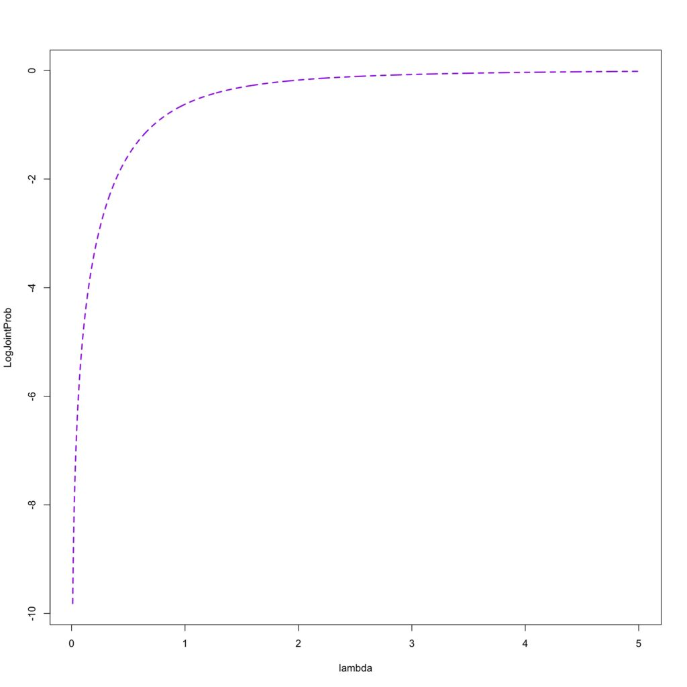
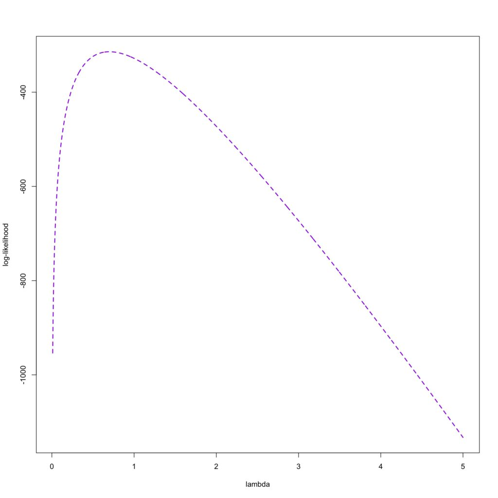

فرض کنید که ۲۰ مشاهده داریم که از توزیع پواسون با پارامتر (λ\lambda = 2) به وجود آمده است. آن را در R پیاده سازی کردیم:

```
rpois(20,2)
 [1] 3 2 0 1 7 2 1 3 4 2 1 1 3 1 0 2 2 2 2 1
```

در اینجا می دانیم پارامتر توزیع ما چیست و می توانیم داده های بیشتر هم تولید کنیم.  
حالا تصور کنید که ما داده هایی داریم که می دانیم از توزیع خاصی پیروی می کنند مانند توزیع پواسون، ولی هیچ اطلاعاتی راجب پارامتری که آن داده ها تولید شده اند نداریم.

در این زمان روش های مختلفی برای برآورد کردن پارامتر توزیع وجود دارد که یکی از مهمترین و کاربردی ترین آنها در مباحث یادگیری ماشین استفاده از MLE (Maximum Likelihood Estimation) یا برآورد بیشینه درستنمایی است.

در R یک دیتاستی داریم به نام Prussian است این دیتاست تعداد سربازانی را که از سال ۱۸۷۵ تا سال ۱۸۹۴ با لقد اسب فوت شدند را جمع آوری کرده است و مجموعا ۱۹۶ نفر بر اثر این حادثه فوت کردند.  
حدس میزنیم که این داده ها از توزیع پواسون پیروی می کنند.

یکی از فرضیات توزیع پواسون این است که میانگین و واریانس آن با هم برابر باشند.

```
> mean(p)
[1] 0.7
> var(p)
[1] 0.762724
```

این فرض توزیع پواسون اینجا برآورده می شود، و می گوییم که این داده ها از توزیع پواسون پیروی می کنند ولی با چه پارامتر λ\lambda ؟ این سوالی است که روش درستنمایی به ما کمک می کند تا به جواب برسیم.

می دانیم که تابع احتمال توزیع پواسون به این شکل است:

f(x)=e−λλxx!f(x) = \frac{e^{-\lambda} \lambda^x}{x!}

اگر احتمال رخ دادن اولین مشاهده را در نظر بگیریم که x = 0 است و یک λ\lambda را انتخاب کنیم به عنوان مثال λ\lambda = 1

f(x=1|λ=1)=e−1111!=0.3678794f(x = 1 | \lambda = 1) = \frac{e^{-1} 1^1}{1!} = 0.3678794

حالا به عنوان مثال یک λ\lambda دیگری را در نظر بگیریم به عنوان مثال λ\lambda = 2

f(x=1|λ=2)=e−2211!=0.1353353f(x = 1 | \lambda = 2) = \frac{e^{-2} 2^1}{1!} = 0.1353353

همانطور که مشاهده می کنید با افزایش λ\lambda احتمال رخداد x=1 کمتر شد، پس λ\lambda=1 ، پارامتر بهتری است برای x=0.

حالا به مشاهده بعدی می رویم که x= 2 هست. احتمال با دو λ\lambda قبلی را حالا برای x=2 نیز حساب می کنیم:

f(x=2|λ=1)=e−1122!=0.1839397f(x = 2 | \lambda = 1) = \frac{e^{-1} 1^2}{2!} = 0.1839397

f(x=2|λ=2)=e−2211!=0.2706706f(x = 2 | \lambda = 2) = \frac{e^{-2} 2^1}{1!} = 0.2706706

همانطور که دیدیم این مقادیر x با λ\lambda ها متفاوتی احتمال آنها ماکزیمم می شود.

حالا اگر بخواهیم احتمال توزیع توام این دو مقادیر را نیز محاسبه کنیم این عدد حتی کمتر نیز می شود:

f(x=1|λ=1)×f(x=2|λ=1)f(x = 1 | \lambda = 1) \times f(x = 2 | \lambda = 1)

e−1111!×e−1122!=0.06766764\frac{e^{-1} 1^1}{1!} \times \frac{e^{-1} 1^2}{2!} = 0.06766764

حالا برای زمانی که λ\lambda = 2 است احتمال توزیع توام را محاسبه کنیم:

f(x=1|λ=2)×f(x=2|λ=2)f(x = 1 | \lambda = 2) \times f(x = 2 | \lambda = 2)

e−2211!×e−2222!=0.03663128\frac{e^{-2} 2^1}{1!} \times \frac{e^{-2} 2^2}{2!} = 0.03663128

*حتی کوچکتر از قبل می شود.*

تصویر پایین نشان دهنده زمانی است که λ\lambda ماکزیمم می شود در دو مشاهده ای که داشتیم.



ما که در این داده فقط دو مشاهده نداریم اگر فقط همین دو مشاهده بود تصمیم می گرفتیم که λ\lambda = 1 می تواند بهترین پارامتر برای ما باشد. ولی در اینجا 280 (با در نظر گرفتن سال هایی که صفر بودند) مشاهده داریم و نیاز هست که پارامتری را پیدا کنیم که احتمال توزیع توام آنها ماکزیمم شود.

کاری که ما با MLE قرار هست انجام دهیم به نوعی همین کاری است که برای این دو مقادیر انجام داده ایم.  
برای اینکه MLE را محاسبه کنیم باید تابع توزیع احتمال را بلد باشیم که در اینجا تصمیم گرفتیم و نشان دادیم که از تابع توزیع پواسون داده ها پیروی می کنند.  
برای روش MLE اولین کاری که نیاز هست انجام بدیم پیدا کردن تابع درستنمایی است که از حاصل ضرب احتمال ها بدست می آید به این شکل:

P(y1,y2,...,yn|λ)=∏i=1nP(yi|λ)P(y\_1,y\_2,...,y\_n | \lambda) = \prod\_{i=1}^{n} P(y\_i | \lambda)

داده های مشاهده شده ما ثابت هستند و تغییر قرار نیست کنند به همین دلیل با حروف کوچک آنها را نشان دادیم، اما λ\lambda که داریم قرار هست تغییر کند تا احتمال ما را بیشینه کند به همین دلیل این تابع احتمال شرطی است که احتمال مشاهده داده ها را با تغییر λ\lambda به ما نشان می دهد

به دلیل اینکه داده هایی که داریم زیاد هستند و همانطور که دیدیم وقتی احتمال توام آنها محاسبه می کنیم داده ها همینطور کوچک و کوچکتر می شوند و مشکلاتی در ادامه رخ می دهد، برای جلوگیری معمولا از تابع log استفاده می کنیم.

l(λ)=logP(y1,y2,...,yn|λ)=log∑i=1nP(yi|λ)l(\lambda) = logP(y\_1,y\_2,...,y\_n | \lambda) = log\sum\_{i=1}^{n} P(y\_i | \lambda)

یک نکته که باید دقت کنیم آن است که زمانی که log را پشت product Π\Pi قرار دادیم تبدیل به سیگما ∑\sum (جمع) شد، به دلیل خاصیت های لگاریتم است.  
نکته بعدی که میشه بیان کرد این هست که فرقی ندارد که کدام یک از توابع را ماکزیمم کنید (با لگاریتم یا بدون لگاریتم) هر دو جوابی که می خواهیم را به ما می دهد اما عملیات های ریاضی که با لگاریتم انجام شود کار را بسیار آسان تر می کند.  
برای مثال در احتمال مشاهداتی دو داده اول از این روش رفتیم و هیچ تفاوتی با زمانی که لگاریتم نداشتیم در جواب ندیده شد.



می بینیم که در همان عدد ۱ ماکزیمم شده است

اگر این عملیات ریاضی را برای کل داده ها در R انجام دهیم این نموداری است که به ما داده می شود وλ\lambda که احتمال ما را بیشینه می کند برابر است با عدد 0.6989645.



اما نیاز نیست که تابع احتمال درستنمایی را برای هر کدام از داده ها پیدا کنیم و ماکزیمم آن را انتخاب کنیم کار بهتری که میتوان انجام داد که خیلی سریع تر ما را به نتیجه می رساند استفاده از مشتق تابع لگاریتم درستنمایی است، از حسابان می دانیم که با مشتق گرفتن می توانیم ماکزیمم توابع را پیدا کنیم حالا چرا از این نکته در اینجا استفاده نکنیم ؟

می دانیم از قبل که :

P(x)=e−λλxx!P(x) = \frac{e^{-\lambda} \lambda^x}{x!}

از آن لگاریتم می گیریم :

logP(x)=−λ+xlogλ−logx!log P(x) = -\lambda + x log \lambda - logx!

می دانیم که تابع درستنمایی (آن چیزی که میخواهیم ماکزیمم کنیم) جمع این ها از ۱ تا n است به همین دلیل:

l(x)=∑i=1n(−λ+xlogλ−logx!)l(x) = \sum\_{i=1}^{n}(-\lambda + x log \lambda - logx!)

 که می شود:

l(x)=−nλ+logλ∑i=1nx−∑i=1nlogx!l(x) = -n\lambda + log \lambda \sum\_{i=1}^{n} x - \sum\_{i=1}^{n}logx!

حالا یک بار مشتق از آن می گیریم:

−n+∑i=1nxiλ=0-n + \frac{\sum\_{i=1}^{n}x\_i}{\lambda} = 0

با تنها کردن λ\lambda و یک بار معکوس کردن:

λ=x‾\lambda = \bar{x}

این به ما می گوید که برآورد نااریب برای λ\lambda برابر میانگین داده ها است، همین کار را در R نیز انجام می دهم:

```
> mean(prussian$y)
[1] 0.7
```

که روشی بسیار ساده تر است، یعنی ما پارامتر را با میانگینی که داده ها داشتند برآورد کردیم.

همانطور که مشاهده شد می توان به این شیوه پارامتر هر توزیعی را تخمین زد و ممکن است شرایطی و توزیع هایی باشند که به همین سادگی پارامترهای آن قابل تخمین زدن نیست و از روش هایی عددی استفاده می شود در آینده راجب این شیوه نیز می نویسم.
