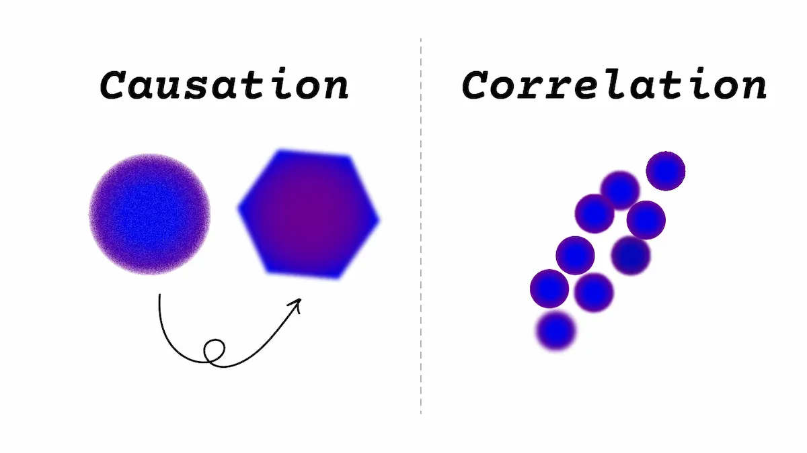
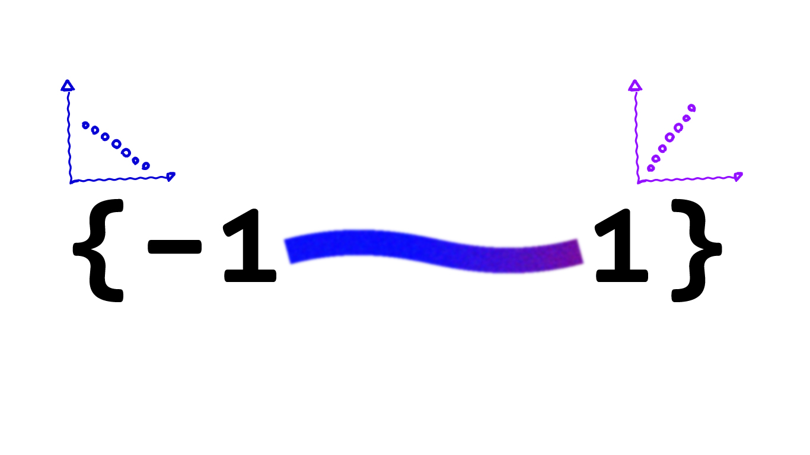
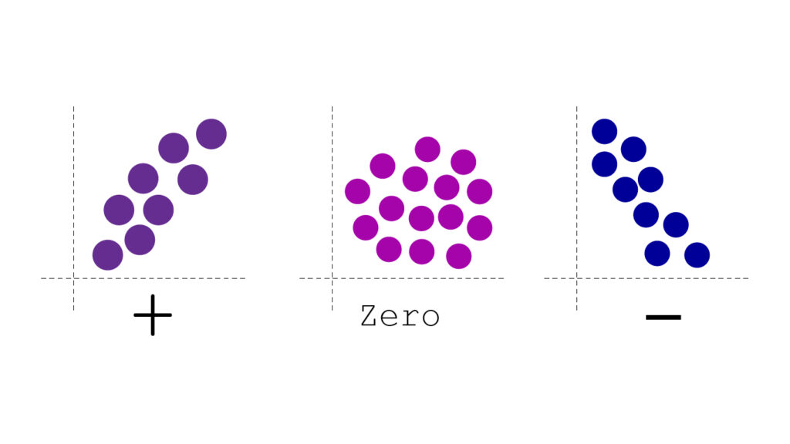
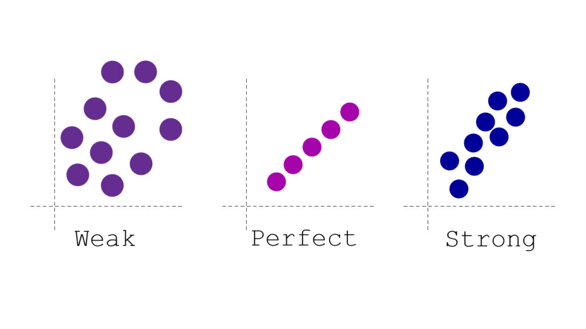
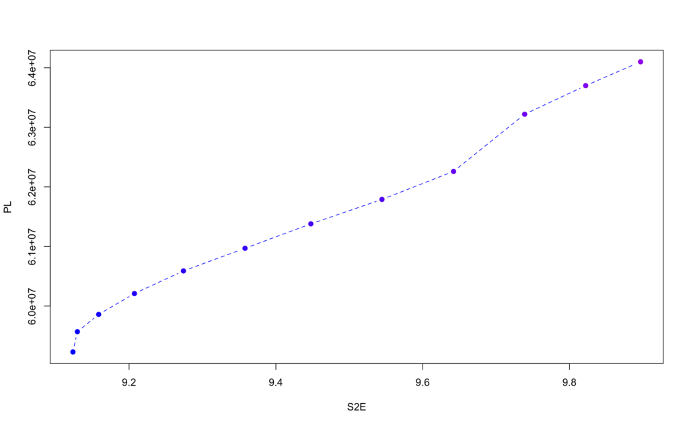
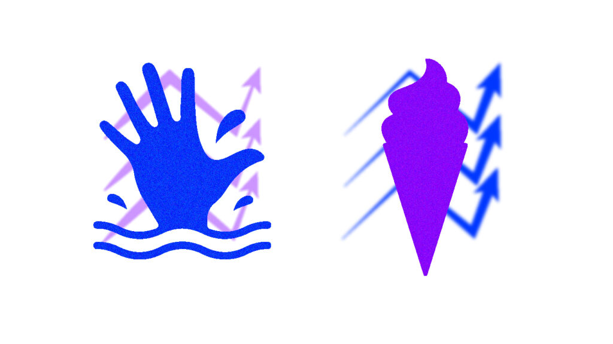

همبستگی یا correlation یعنی متغیرها در کدام جهت و به چه شدتی نسبت به یکدیگر حرکت می کنند.

این میزان همبستگی بین ۱ و -۱ خواهد بود.

* اگر r = 1 باشد، هم خطی کامل است و در جهت یکدیگر حرکت می کنند.
* اگر r = -1 باشد، هم خطی کامل است ولی در خلاف جهت هم حرکت می کنند.



**همبستگی زمانی رخ می دهد که دو متغیر همزمان با هم رخ بدهند.**

که یکی از فرمول هایی که همبستگی پیرسون از آن بدست می آید:

r=∑(xi−x‾)(yi−y‾)∑(xi−x‾)2×∑(yi−y‾)2

همبستگی ها می توانند مثبت، منفی یا صفر باشند:



از نگاهی دیگر می توانند قوی، ضعیف و کامل باشند، برای اشکال زیر همبستگی مثبت فرض شده است.



در آمار correlation به این معناست که دو متغیر با هم حرکت می کنند یعنی با افزایش یک متغیر، متغیر دیگر نیز افزایش می یابد (اگر همبستگی مثبت باشد) اما causation به این معناست که یک متغیری باعث و دلیل تغییر در دیگر متغیر است.

## مثالی از Correlation و Causation:

همبستگی ابزار بسیار مهمی در آمار هست ولی یک نکته ای که باید به آن دقت کنیم زمانی هست که همبستگی بالا را با رابطه علت و معلولی (Causation) اشتباه بگیریم به عنوان مثال متغیر 'میزان ساعت کار' با 'میزان درآمد' می تواند یک همبستگی بالا و مثبتی داشته باشد و یک رابطه علت و معلولی هم دارند یعنی اینکه علتِ 'میزان درآمد' بالا به دلیل 'میزان ساعت کار' بالا هست. (یک همبستگی مثبت دارند)

ولی به عنوان مثال آیا می دانستید میانگین فاصله زحل تا زمین با تعداد اعضای کتابخانه های عمومی در انگلستان، همبستگی ۹۹ درصد دارند؟ ولی میدانیم که این دو متغیر هیچ رابطه علت و معلولی با یکدیگر ندارند.

**به مثال زیر توجه کنید:**

ما دو ستون داریم:

* اولین ستون: میزان فاصله زحل تا زمین، که میانگین فاصله هر ساله اندازه گیری شده است.
* ستون دوم: که نشان دهنده تعداد اعضای کتابخانه های عمومی در انگلستان را در طول سال ها نشان می دهد.

وقتی در R، همبستگی بین این دو متغیر را اندازه گیری می کنیم متوجه می شویم که:

```
S2E <-c(9.12351,9.12955,9.15859,9.20728,9.27406,9.35796,9.44766,9.54454,9.64202,9.73894,9.82207,9.89684)
PL <- c(59230000,	59570000,	59860000,	60210000,	60590000,	60970000,	61380000,	61790000,	62260000,	63220000,	63700000,	64100000)

cor(S2E,PL)
[1] 0.9943865
```

همبستگی خیلی بالایی (0.99) دارد نزدیک به یک هست.

زمانی که نمودار آن را هم رسم می کنیم این موضوع را تایید میکند:



* محور x نشان دهنده میانگین فاصله زحل تا زمین است.
* محور y نشان دهنده تعداد اعضای کتابخانه های عمومی در انگلستان است.

این نمودار یک نکته ای دارد که نشان می دهد با اینکه این دو متغیر نسبت بهم دارای **همبستگی قوی مثبت**  هستند ولی هیچ رابطه علت و معلولی ندارند.

در این مثال درک کردیم که چرا همبستگی باعث علت و معلولی (causation) نمی شود.

[منبع](https://tylervigen.com/spurious/correlation/39762_the-distance-between-saturn-and-earth_correlates-with_number-of-public-library-members-in-the-uk)

## مثالی دیگر:

**فرض کنید که در اخبار می خوانید**:



> **فروش بستنی باعث افزایش غرق شدن انسان ها می شود**
>
> خبر موثق

وقتی به این تیتر خبری نگاه می کنید با خودتان می گویید که مگر می شود افزایش فروش بستنی باعث غرق شدن انسان ها شود؟

ما در اینجا یک متغیر دیگر را در نظر نگرفته ایم که آن **'دمای هوا'** است.


با افزایش گرمای هوا میزان فروش بستنی افزایش پیدا میکند و هم باعث رفتن بیشتر افراد به ساحل و به همان دلیل باعث افزایش غرق شدن می شود.

به آن، **متغیر مخدوش شده** (confounding variable) گفته می شود.

## چطور متوجه (علیت)Causation شویم؟

می دانیم تا اینجا که از همبستگی نمی توان علیت را نتیجه گرفت یا نمی شود علیت را از همبستگی اثبات کرد.

وقتی می دانیم که یک متغیر مانند A با یک متغیر دیگر مانند B، همبستگی دارد می توان از آن ۴ نتیجه گرفت:

* از A می توان B را نتیجه گرفت.
* از B می توان A را نتیجه گرفت.
* از یک متغیر دیگر مانند C می توان A و B را نتیجه گرفت.
* به تصادف رخ داده است.

بعضی از اوقات اما همبستگی، ما را به سمت علت نیز سوق می دهد.

به عنوان مثال برای فردی که سیگار می کشد، ریسک سرطان ریه نیز افزایش پیدا میکند، به همین جهت دارای همبستگی بالایی هست و این موضوع به ما اشاره میکند که رابطه علت و معلولی آن نیز مورد بررسی قرار بگیرد.

### چطور روابط علت و معلولی را تشخیص دهیم؟

* کنترل آماری
* آزمایش تصادفی کنترل شده

هیچ روش واحدی وجود ندارد که با قطعیت ۱۰۰ درصد علیت را ثابت کند، بلکه چند روش وجود دارد که هر کدام سطح متفاوتی از اطمینان را به ما می‌دهند.

یک از روش ها **کنترل آماری** است؛ یعنی متغیرهای مخدوش‌کننده *(مانند گرما در مثال فروش بستنی و غرق شدن انسان ها)* که می‌شناسیم را اندازه‌گیری و آن را مثلاً با **رگرسیون** کنترل می‌کنیم.

*اما این روش هم در برابر متغیرهایی که اصلاً به ذهن‌مان نرسیده نمی تواند خوب عمل کند.*

روش **استاندارد** برای اثبات علیت، **آزمایش تصادفی‌شده کنترل‌شده** است؛ جایی که افراد به‌صورت تصادفی به گروه‌های درمان و کنترل تقسیم می شوند.

تصادفی‌سازی این مزیت را دارد که تمام متغیرهای مخدوش‌کننده، حتی آن‌هایی که نمی‌شناسیم، را به‌طور میانگین خنثی می‌کند.

## حالا که چی؟

اگر نتوانیم این دو موضوع را از هم تشخیص دهیم، باعث می شود که تحقیقات علمی را به درستی متوجه نشویم.

با فهم و درک این مفاهیم اما می توانیم واقعیت های جهان را درست تر و صحیح تر درک کنیم، اگر تفاوت بین روابط همبستگی و علت و معلولی را ندانیم از حقیقت ها بی خبر می مانیم.
