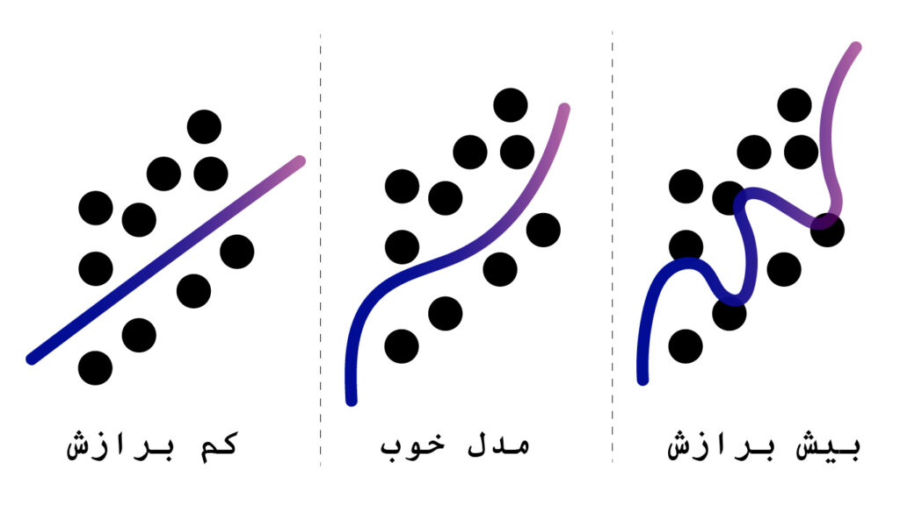

یکی از جالبترین و اصلی ترین پدیده ها در مدل های supervised یادگیری ماشین, موازنه کردن اریبی و واریانس است.

قبل از اینکه متوجه شویم این پدیده چیست باید با اریبی (bias) و واریانس آشنا شویم.

* اریبی
  + under-fit
* واریانس
  + over-fit

## اریبی:

اریبی در اینجا به معنای ناتوانی و ضعف مدل در generalization یا تعمیم دادن است.

به این معنا که هرچه مدل اریبی (bias) بالاتری داشته باشد، کمتر می تواند الگوها را درک کند و باعث underfit شدن مدل می شود.

### under-fitting:

under-fitting یک معضلی است که سرچشمه گرفته از اریبی و ساده بودن مدل ما هست.

یعنی اینکه مدلی که طراحی کردیم, نمی تواند آنچه که در واقعیت داده های ما وجود دارد را بیابد و نمی تواند رابطه ای که بین ورودی و خروجی داده ها وجود دارد را بیابد.

مدلی که داریم فرقی با رندوم نخواهد داشت.  
این مانند آن است که دانش آموزی درس نخواند و به همین دلیل هم نتواند نتیجه ای خوبی در آزمونش بگیرد.

زمانی متوجه under-fitting می شویم که مدل ما هم در زمان train و هم در زمان test ناکام بماند و خوب عمل نکند. در این زمان می گوییم مدل ما under-fit شده است و باید پیچیدگی مدل خودمان را بیشتر کنیم.

### چطور مشکل underfitting را حل کنیم؟

با افزایش دادن feature ها، به مدل میتوانیم پیچیدگی مدل را بیشتر کنیم. به همین دلیل مدل میتواند بهتر از قبل الگویی که داده های ما دارد را درک کند.

## واریانس:

واریانس بر خلاف اریبی، اگر افزایش پیدا کند مدل نویزهایی که در داده وجود دارد را یاد می گیرد به جای اینکه الگوهای مهم را بیاموزد، و با داده ها حساس تر و جزئی نگرتر برخورد می کند و منجر به overfit یا بیش برازش می شود.

بیش برازش یا overfitting زمانی رخ می دهد که مدل ما پیچیدگی بسیاری دارد که مدل هایی مثل Decision Trees بسیار مستعد به overfit شدن هستند.  
خارجی ها یک مثلی دارند: curiosity killed the cat, به این معنا که کنجکاوی باعث مردن آن گربه شد.

زمانی از این مثل استفاده می شود که میخواهیم به کسی هشدار دهیم که در کاری دارد سرک می کشد که به آن مربوط نمی شود همین را میتوانیم به مدلی تعمیم دهیم که overfit شده است.  
اگر بخواهیم مثالی بزنیم، دانش آموزی را تصور کنید که تمام سوالات استادش را حفظ کرده ولی هیچ چیزی را یاد نگرفته است و به همین دلیل نمی تواند در امتحانی که **قرار هست سوالهای جدید ارائه شود** خوب عمل کند و نمره پایینی در امتحان می گیرد.

زمانی که مدل در زمان train **فوق العاده** خوب عمل میکند ولی زمانی که به مرحله test می رود عملکرد آن **به شدت کاهش می یابد**، این به معنایی overfit شدن مدل است.

تناقض زمانی رخ می دهد که می خواهیم یک مدلی را انتخاب کنیم که هم **رابطه بین داده های ورودی و خروجی** را درک کند و هم بتواند در **داده های دیده نشده** نیز خوب عمل کند. این دو موضوع نمی تواند همزمان رخ دهد:

* اگر واریانس **بالا** داشته باشیم **(bias کم)**: مدلی که طراحی می شود، تمام **نویز ها** که در داده های train وجود دارد را استخراج می کند. *(ولی هیچ اثری در یادگیری مدل ما ندارند)* به همین در زمان train بسیار عالی عمل می کنند ولی در زمانی که داده های test به مدل داده می شود نمی تواند آن عملکرد را حفظ کند. در اینجا مدل رابطه بین ورودی و خروجی را به خوبی درک کرده است ولی نمیتواند در داده های دیده نشده نیز خوب عمل کند.
* اگر واریانس **پایین** داشته باشیم (**bias زیاد**): در این شرایط مدل اصلا نمی تواند الگوها را تشخیص دهد و هم در زمان train و هم در زمان test وضعیت بدی خواهد داشت. در اینجا در هر دو مرحله ناتوان می شود.

## حالا ما این پدیده را در شرایط رگرسیونی بررسی خواهیم کرد.

در شکل زیر نشان می دهیم که در زمان Under-fit , Overfit و مدل مناسب، مدل رگرسیونی چه رفتاری از خود نشان می دهد:

همانطور که می بینید:

* در زمانی که **کم برازش** (Under-fit) است تمام اطلاعات را مدل از داده ها دریافت نمی کند.
* در زمانی که مدل مناسب و خوب باشد، مدل می تواند الگوهای داده را به خوبی دریافت کند.
* زمانی که بیش برازش (Over-fit) رخ می دهد مدل به خوبی اطلاعات را از داده های موجود استخراج می کند، اما نمی تواند آن را تعمیم دهد.

به همین دلیل به موازنه اریبی-واریانس در مدل های رگرسیونی می پردازیم:

* سه روش حل مشکل واریانس در رگرسیون:
  + Ridge
  + LASSO
  + ELastic Net

این موضوع دلیلی برای وجود رگرسیون های LASSO و Ridge است. این رگرسیون ها با ارائه dimensionality reduction یا کاهش ابعاد به ما کمک در انتخاب feature و کاهش واریانس و به سبب آن باعث جلوگیری از over-fit شدن مدل خواهند کرد.

در این شرایط مدل رگرسیونی Ridge, ضرایب رگرسیونی بزرگی که داریم را **کوچک** میکند.

در رگرسیون LASSO، این مدل رگرسیونی با شدت بیشتری عمل خواهد کرد و feature هایی که نیاز نیستند را به طور کلی از مدل حذف خواهد کرد و ضرایب رگرسیونی آن را دقیقا برابر صفر میکند.

*یک نام دیگری نیز برای این دو مدل رگرسیون وجود دارد:*

* LASSO به نام L1 regularization
* ridge به نام L2 regularization

به طور کلی عملکرد این دو مدل باعث یک تعادلی در سادگی و پیچدگی میشود.

همانطور که میتوانید حدس بزنید هر کدام از این مدل ها ویژگی های خوب و بد خودشان را دارند:

ویژگی های خوب و بد رگرسیون LASSO:

* خوب:
  + مدل نهایی فقط از زیرمجموعه از feature ها استفاده می کند
  + بسیار مناسب برای زمانی که تعداد feature ها بیشتر از نمونه است.
* بد:
  + زمانی که دو feature با همبستگی زیاد داریم، مدل یکی از آنها حذف خواهد کرد و ما نمی توانیم آن را کنترل کنیم.
  + feature ها باید استاندارد شده باشند.

ویژگی های خوب و بد رگرسیون Ridge:

* خوب:
  + به ما یک جواب نمی دهد مانند LASSO و برای یک شرایط می تواند جواب های مختلفی را ارائه دهد.
  + در شرایط یکسان قدرت پیشبینی رگرسیون Ridge بیشتر از LASSO است
  + با feature های با همبستگی بالا عملکرد بهتری دارد، ضرایب آنها را نزدیک به هم و نزدیک به صفر می کند و آنها را حذف نمی کند و همین باعث ثبات در مدل می شود.
* بد:
  + از تمام feature ها استفاده می شود و هیچ feature حذف نخواهد شد.
  + زمانی که feature ها نامربوط داشته باشیم آنها را حذف نمی کند و باعث وجود نویز در مدل می شود.
  + نیاز به استانداردسازی داده ها دارد.

### Elastic Net:

با توجه به این دو روش regularization ما یک روش دیگر به نام Elastic Net داریم که هم از L1 و هم از L2 استفاده می شود.

به طور خلاصه برای حل کردن مشکلات دو حالت داریم:

* Over-fit: از L1 و L2 یا Elastic Net استفاده می کنیم تا مدلی با پیچیدگی کمتری داشته باشیم به این روش ها به اصطلاح (Regularization) گفته می شود.
* Under-fit: مدل را با اضافه کردن feature های جدید پیچیده تر و انعطاف پذیرتر کنیم.
