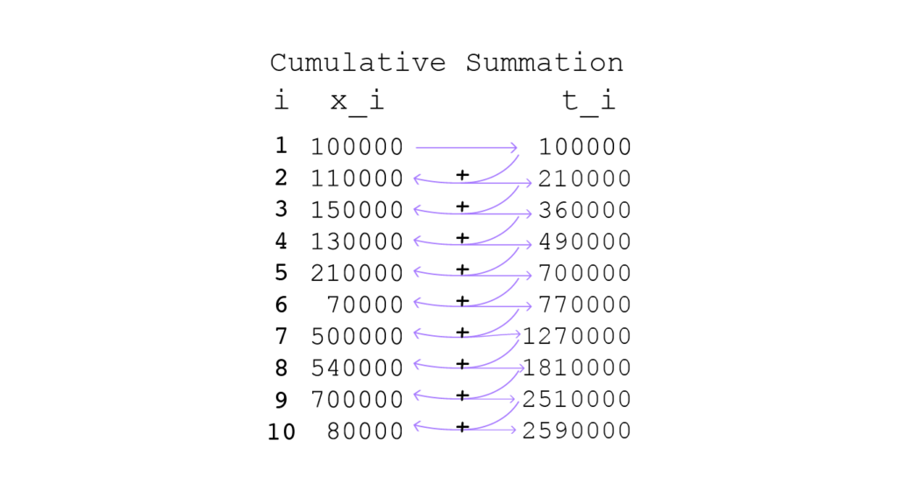
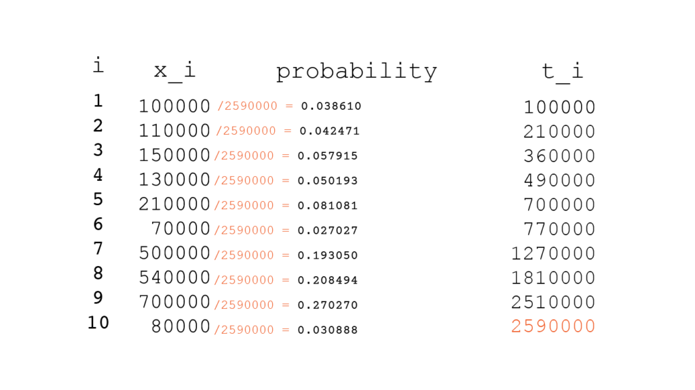
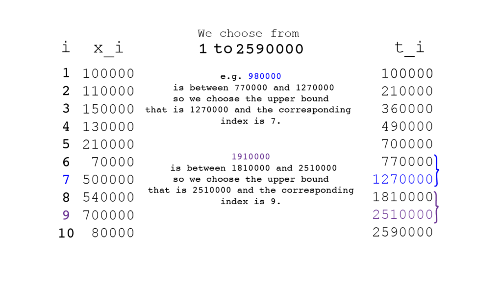
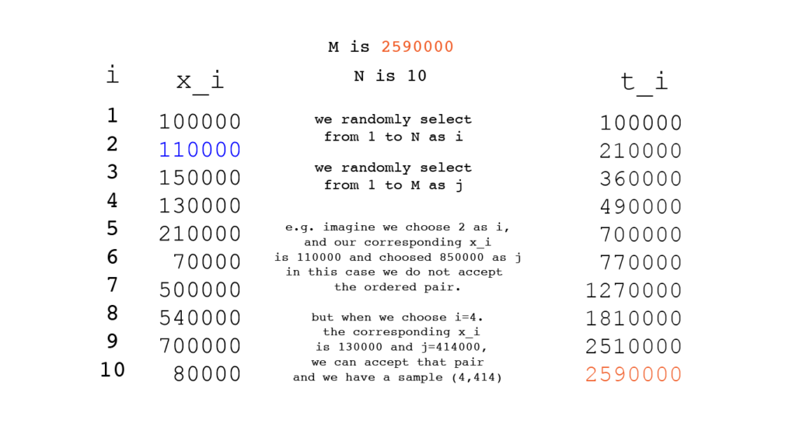

## probability proportional to size (PPS) sampling

This method of sampling can help us in populations that the units of the population do not have equal chance of selection.

below example can help us understand this method better:

> Imagine we have number of population of 10 cities in a country, the numbers would be
>
>
>
> ***100000,110000,150000,130000,210000,70000,500000,540000,700000,80000***
>
>
>
> based on these numbers the population of this country is 2590000.
>
>
>
> we get a sample of this numbers with the length of 4, and the result is 100000,130000,70000,80000.
>
>
>
> when we got the mean of these values we get 95000, and based on this result we assume that by average, population of each city is 95000, so we know that 95000 \* 10 is 950000, and we assume that this number is the population of this country but **IT IS WRONG**, the real number of population is **2590000**.

### *Then what is the correct way?*

A healthy mind would suggest that we should give the population with more people more chance of selection *(weight)* compared to the populations with less people in them.

with this in mind we get a more accurate sense of what really is going on.

### the procedure in PPS sampling.

first we should know what information we have ?  
we have a list of data about ANYTHING, in this case we have population of cities in a country.

> 100000,110000,150000,130000,210000,70000,500000,540000,700000,80000

we put this number in a column called x\_i and put it aside.  
then we make t\_i column.

#### what is t\_i?

in the python language the t\_i is Cumsum of x\_i (the cumulative summation of x\_i ).  
*we can use Numpy to perform this cumulative summation.*

##### what is cumulative summation?

it's a really simple concept we start from the first number in the x\_i and we sum with the next item and go till the end

cs\_1​=x\_1​  
cs\_2 = x\_1+x\_2  
.  
.  
.  
cs\_n = x\_1 + x\_2 + ... + x\_n

Performing Cumulative Summation for our example:



#### Making the probability column.

after making x\_i and the t\_i then we divide x\_i by the last value of t\_i and the result is the probability that each x\_i have.



### What Now?

we choose *k* number of random values, from 1 to the last number in the t\_i.



You can see the implementation of this procedure in Python.

Python code for PPS imperative paradigm

```
# PPS in sampling.

# import library
import random
import numpy as np
import pandas as pd

# make x_i
x_i = [100,110,150,130,210,70,500,540,700,80]
sum(x_i)

# choose k number of x_i
select = random.choices(x_i , k=4)
np.mean(select)

# make the t_i: the cumulative summation
t_i = np.cumsum(x_i)

# making DataFrame to showcase the columns
# nothing to do with the calculation

df = pd.DataFrame()
df['x_i'] = x_i
df['t_i'] = t_i
df['prob'] = x_i / t_i[-1]
print(df)

# make list between 1 to the last item in the t_i
sampleChoose = list(range(1,t_i[-1]+1))

# we choose 4 numbers between 1 
# to the last item in the t_i
# make a for loop to implement the rules of PPS
sampleChoosen = random.choices(sampleChoose , k=4)
samples = []
for i in sampleChoosen:
    for j in t_i:
        if i < j:
          print(j)
          samples.append(j)
          break

t_i = t_i.tolist()

# showing the result (what samples we should choose?)
theSamplesWeChoose = []
for i in samples:
    f = t_i.index(i)
    theSamplesWeChoose.append(f)
```

### Implementation of PPS in Object Oriented Programming:

```
import random
import numpy as np
import pandas as pd

class Pps:
    def __init__(self,x_i,k):
        self.x_i = np.array(x_i)
        self.t_i = np.cumsum(x_i)
        self.prob = x_i / self.t_i
        self.TotalSize = self.t_i[-1]
        self.k = k
        self.sample_idx = self.get_sample
        self.df = pd.DataFrame({
            'x_i': x_i,
            't_i': self.t_i,
            'probability': x_i/self.t_i
        })
        
    def get_sample(self):
        # we choose k number of sample from 1 to end of the cumulative summation
        idx = np.random.choice(range(1,self.TotalSize+1) , size = self.k)
        samples = []
        for i in idx:
            for j in self.t_i:
                if i < j :
                    samples.append(j)
                if len(samples) == self.k:
                    break
        
        
        samples_idx = []    
        t_List = self.t_i.tolist()
        for z in samples:
            f = t_List.index(z)
            samples_idx.append(f)
        return samples_idx
```

the use case of this code is very simple, when you run this code all you have to do is make an instance of this class and pass your x\_i in.

```
# make the x_i
x_i = [100, 110, 150, 130, 210, 70, 500, 540, 700, 80]

# make an instance of that class and pass your list to it
# and the number of samples you want to get.

Mylist = Pps(x_i,4) 
Mylist.df # this table show us the table that we have made.
Mylist.get_sample()
```

when you use this code you get 4 samples from our x\_i.

## Lahiri's method of selection of sample units

based on what we know from PPS, there is a another way that we can select units of samples from our data.

we know what x\_i is, based on what we learned from earlier.

the steps of Lahiri's method:

1. we find the ***biggest x\_i*** and assign it as ***M***.
2. We will find out about **Population size** and assign it as **N**.
3. then we need to find this ordered pair (i,j) where i is between 1 and N, j is between 1 and M.

when we found the i. we pass i to the x[i], meaning we want the i-th number in the x\_i.

if x\_i > j then we accept that ordered pair and if x\_i < j then we reject that ordered pair & do not use it.

Maybe you can find this picture helpful:



You can see this method of sample selection in Python.

Python code for Lahiri's method (imperative paradigm)

```
import random

x_i = [100,110,150,130,210,70,500,540,700,80]
M= max(x_i)
N = len(x_i)
k = 6

sample = []       
while len(sample) < k:
    i = random.choice(range(1,N))
    j = random.choice(range(1,M))

    if x_i[i] < j:
        sample.append([i,j])
```

```
import random

arr = [100, 110, 150, 130, 210, 70, 500, 540, 700, 80]
class Lahiri:
    def __init__(self, x_i,k):
        self.x_i = x_i
        self.M = max(x_i)
        self.N = len(x_i)
        self.k = k
    def get_sample(self):
        
        sample = []
        while len(sample) < self.k:
            i = random.choice(range(1,self.N))
            j = random.choice(range(self.N))
            
            if self.x_i[i] > j:
                sample.append([i,j])
        return sample
```

the use cases for Lahiri's method is similar to the last one:

```
MyList = Lahiri(arr,3)
MyList.get_sample()
```

With this methods that i've explained, you can sample your data even if you don't have a uniformly distributed population.

You can use these methods to grasp a better understanding about you data.
