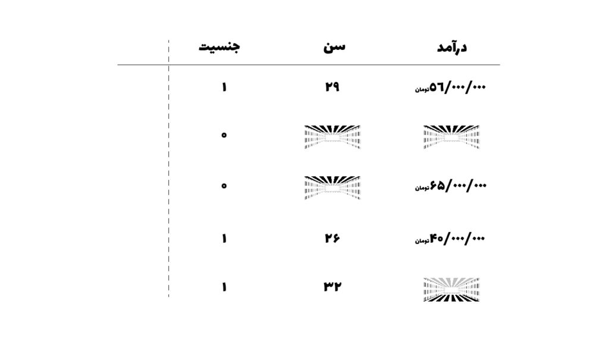
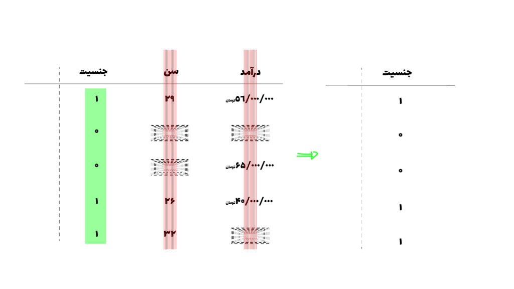
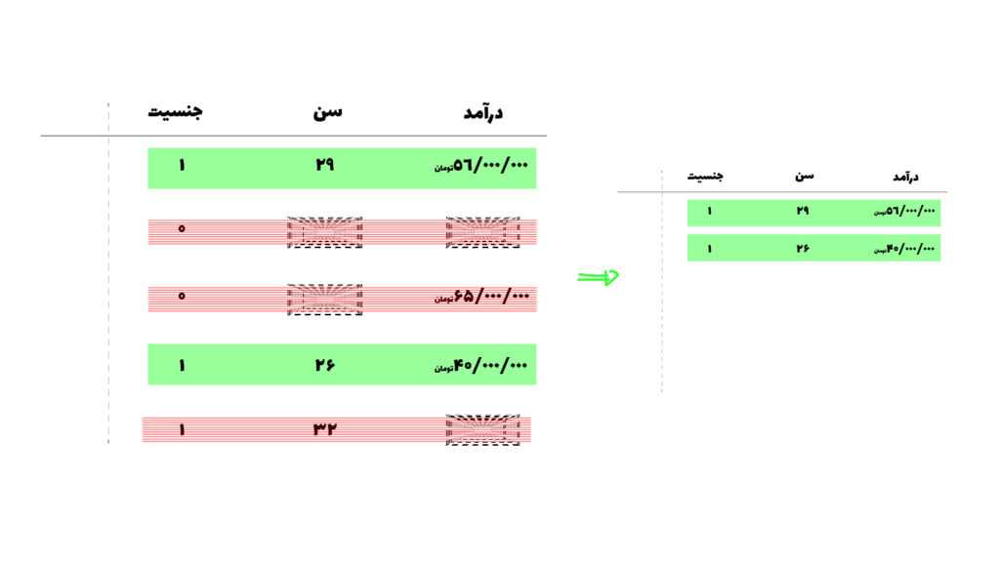

داده های از دست رفته (missing values) زمانی به وجود می آیند که کاربر اطلاعاتی که نیاز هست را وارد نکرده باشد یا بخشی از داده اصلا اندازه گیری نشده باشند. این مشکل میتواند به دلایل و شرایط مختلفی رخ دهد.

ولی در کل زمانی می گوییم که دیتاست ما دارای داده های از دست رفته است که یک سری مقادیرِ متغیر ها تعریف نشده باشد. به عنوان مثال تصور کنید که این بخشی متغیرهای یک دیتاست است:

همینطور که می بینید ممکن است افرادی سن یا درآمد خودشان را وارد نکنند و ما دیتایی ناکامل و به اصطلاح دارای missing values خواهیم داشت.

کنترل کردن داده های از دست رفته یکی از کارهای بسیار مهم در feature engineering هست. به این دلیل که اگر به صورت درست این کار انجام نشود، عملکرد مدل ما بسیار بد و نادرست خواهد شد.

## سه نوع داده از دست رفته:

داده های از دست رفته به سه قسمت تقسیم می شوند:

1. داده های از دست رفته به صورت غیرتصادفی
2. داده های از دست رفته به صورت تصادفی
3. داده های از دست رفته به صورت کاملا تصادفی

### داده های از دست رفته به صورت غیرتصادفی (MNAR)

در این حالت، علت از دست رفتن داده به خودِ همان متغیر مربوط است.

به عنوان مثال افرادی راجب حقوقی که دریافت می کند هیچ اطلاعاتی را وارد نمی کند و طبق تجربه معمولا کسانی که حقوق بالایی دریافت می کنند تمایل به ثبت این اطلاعات را ندارند.

این داده ای است که نباید حذف کرد، بلکه باید مورد بررسی قرار داد به دلیل اینکه این اطلاعات راجب حقوق دریافتی می تواند برای مدلی که میخواهیم طراحی کنیم بسیار مفید باشد.

### داده های از دست رفته به صورت تصادفی (MAR)

یک فرصتی دیگر به وجود می آید که داده از دست رفته به دلیل یک متغیر دیگر از دست می روند.

به عنوان مثال ممکن است مشاهده کنیم که کسانی که سن خودشان را بیان نمی کنند در یک گروه جنسیتی قرار می گیرند، و این نشان می دهد که داده‌های از دست‌رفته مربوط به سن، تحت تأثیر متغیر دیگری مانند جنسیت هستند.

### داده های از دست رفته به صورت کاملا تصادفی (MCAR):

این نوع داده‌های از دست‌رفته در دنیای واقعی کمتر مشاهده می‌شود. در این شرایط، نبود داده، کاملاً تصادفی است و به هیچ متغیری وابستگی ندارد؛ برای مثال، فردی به‌صورت اتفاقی یک سؤال را در پرسشنامه جا انداخته باشد.

در این شرایط دو کار می توانیم انجام بدهیم.

1. حذف کردن
   * حذف ستونی
   * حذف سطری
2. پر کردن
   * میانگین
   * میانه
   * مد

## حدف داده های از دست رفته:

یکی از رایج ترین کارها به دلیل آسان بودن آن، حذف کردن داده های از دست رفته است اما این کار به عنوان درست ترین کار شناخته نخواهد شد، به دلیل اینکه اطلاعاتی که می تواند به مدل ما کمک کنند از بین خواهند رفت.

### حذف ستونی:

برای اینکه شرایط حذف ستون را داشته باشیم، اگر ۵۰ درصد یا بیشتر از داده های آن ستون وجود نداشت، آن ستون را حذف می کنیم. البته این آستانه بسته به نوع پروژه و ماهیت داده‌ها می‌تواند تغییر کند.  
اما حذف یک ستون یعنی حذف یک feature از مدل، که میتواند اثرگذار برای مدل ما باشد.

### حذف سطری:

حذف به روش سطری زمانی رخ خواهد که کمتر از ۰.۱٪‌ درصد از دیتاهایمان دارای داده های از دست رفته باشند، اگر سطرهای بیشتری را حذف کنیم اطلاعات مفید برای مدلمان را از دست خواهیم داد.

## پرکردن داده های از دست رفته:

این روش، یک روش بهتر ولی همچنان همراه با محدودیت هایی است، impute کردن یعنی اینکه به جای خالی بودن دیتاست ما یک عددهایی را که نمونه ما را در بر می گیرد در آنجا قرار دهیم، این اعداد میتوانند میانگین، میانه و یا مد باشند. اما محدودیت هم دارند زمانی که این کار را انجام میدهیم می توانند به data leakage منجر شود.

برای مثالی که در اینجا بیان شد اگر بخواهیم دیتاست را با میانگین و میانه پر کنیم (imputation) به این صورت دیتاست ما پر خواهد شد:

این فرآیند یکی از مهمترین گام های feature engineering در یادگیری ماشین خواهد بود، با صبر و حوصله، و اطلاعات کافی باید اقدام به کنترل کردن داده های از دست رفته کنیم.

بدون دانش کافی راجب دیتاست، و کنترل کردن missing values ها به صورت ناآگاهانه باعث تضعیف طراحی مدلمان در آینده خواهیم شد.
