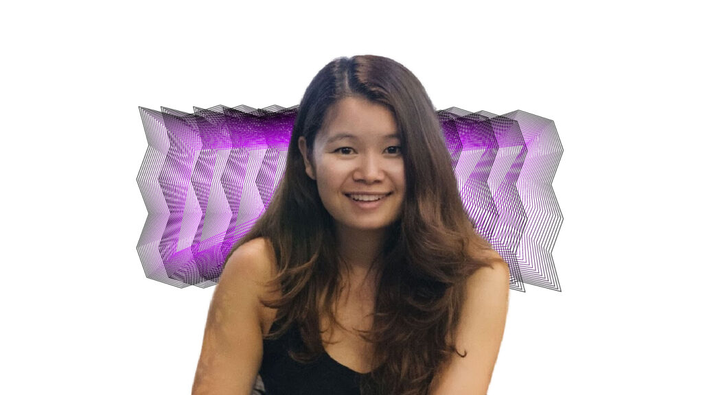
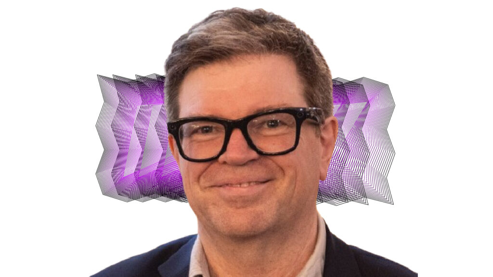
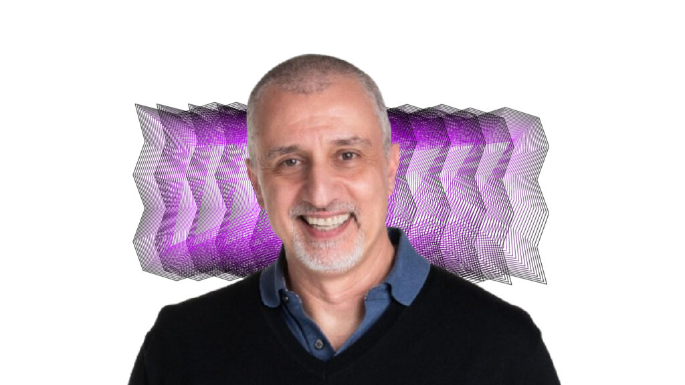
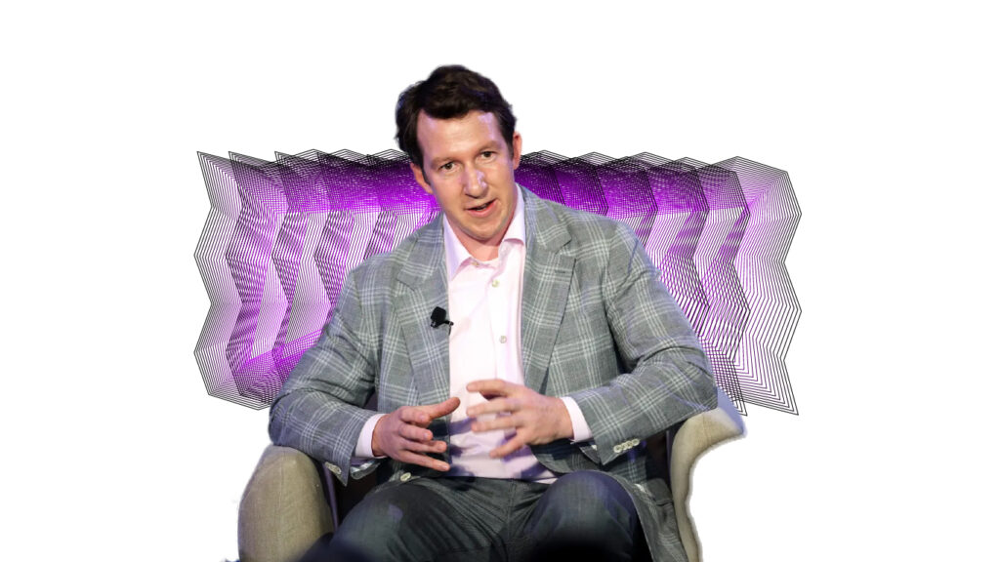
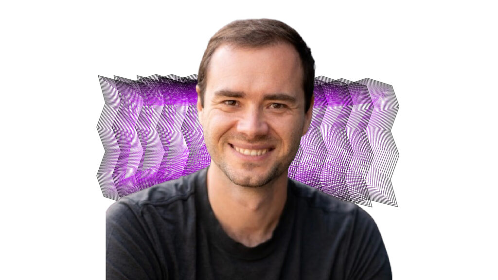
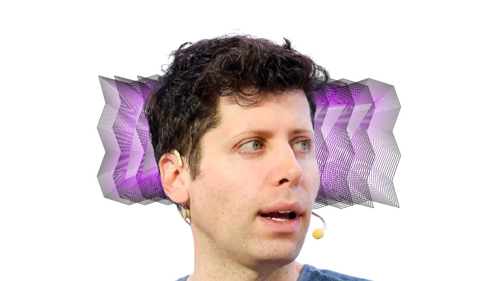
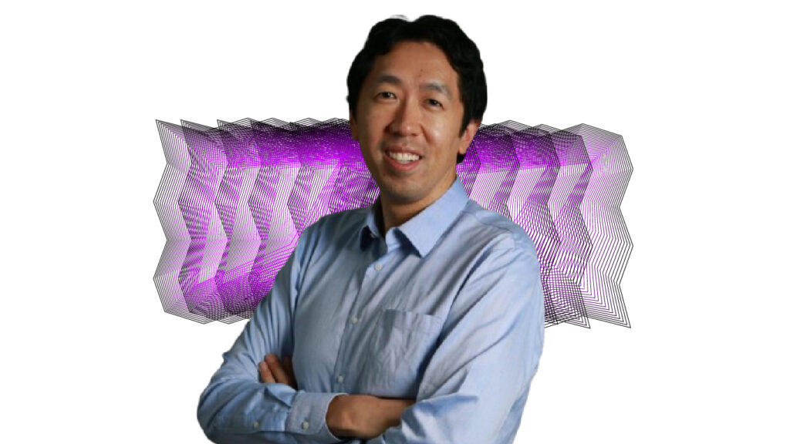

این لیست افرادی است که در یادگیری ماشین برای من تاثیرگذار بوده اند   
امیدوارم که با آشنایی با این افراد درهای گسترده تری برای شما در دنیای یادگیری ماشین باز شود

* 7- Chip Huyen

خانم چیپ هیون در استنفورد تحصیل کردند و در آنجا مشغول به تدریس سیستم های یادگیری ماشین بودند و همین تدریس باعث شد که کتاب بسیار پرفروش و ارزشمند طراحی سیستم های یادگیری ماشین رو بنویسند، ایشون در نتفلیکس، انودیا هم کار کردند و تازه ترین کتاب ایشون به نام مهندسی هوش مصنوعی است

* 6- Yann LeCun

آقای یان لکان، دانشمند هوش مصنوعی در متا هست، و پرفسور در دانشگاه ان وای یو ، و مهمتر از همه، از کسانی است که در توسعه متن باز کردن هوش مصنوعی تاثیر بسیار زیادی داشته اند.

* 5- Peyman Milanfar

دکتر میلانفر یکی از دانشمندان برجسته در گوگل هستند، قبل از اینکه وارد گوگل شوند استاد مهندسی برق در دانشگاه کالیفورنیا بودند. ایشون و تیم ایشان در توسعه زوم دیجیتال در گوشی های پیکسل کار کردند و یکی از ویژگیهای دید در شب را هم در گوشی های پیکسل ۳ را توسعه دادند (که تصاویر **واضحی** از شرایط مختلف نوری را ثبت میکند)

دکتر میلانفر کارهای ارزشمند و بزرگی در زمینه توسعه تکنیک های ناپارامتری (مانند رگرسیون هسته) برای تصویر و ویدیو ها انجام دادند.

* 4- Jack Clark

ایشون یکی از هم بنیانگذاران آنتروپیک هستند و قبل از آن در اوپن ای آی مشغول به کار بودند، آقای جک مسیر متفاوتی را طی کردند که به این نقطه برسند او به عنوان خبرنگار در حوزه های تکنولوژی فعالیت می کردند و زمانی که میخواستند گزارشی راجب مراکز داده بنویسند، روی به زبان (اس کیو ال) آوردند و آن را یاد می گرفتند، و همین علاقه بیشتر و بیشتر شد و وارد اوپن (ای آی) در ۲۰۱۶ شدند.

* 3- Andrej Karpathy

ایشون یکی از عضوهای اصلی در بنیانگذاری اوپن ای آی هستند و در تسلا به عنوان مجری هوش مصنوعی در حال فعالیت می باشند، یکی از ویژگی های منحصر به فرد ایشون صفحه یوتیوبشون هست،محتواهایی که در زمینه مدل های زبانی تولید می کنند که از پایه شروع میکنند و به سمت پیشرفته شدن حرکت می کنند، به گفته خودشون هر ۱۰ ساعت فعالیت و تحقیق باعث تولید شدن ۱ ساعت محتوا می شود.  
یک توصیه ای که ایشون به تازه وارد ها میکنن این هست که سعی کنن که اون موضوع ۱۰۰۰۰ ساعت کار رو انجام، و با تداوم به کار ببرن، و زمان هایی که فکر میکنند که در حال تلف شدن است خود آن نیز تجربه ای است که ما را برای آینده مسلح تر و آماده تر می کنند.

* 2- Sam Altman

حالا که آنقدر صحبت از اوپن ای آی هست آقای سم آلتمن یک کارآفرین آمریکایی هستند که بنیانگذار اوپن ای آی هستند (همون چت جی پی تی خودمون) که دانشجو در دانشگاه استنفورد بودند که بعد از دو سال از تحصیل خارج شدند و شرکت لوپت را ساختند که بعدا به قیمت ۴۳.۴ میلیون دلار به یک شرکت دیگر فروخته شد بعد از آن در یک شرکت شتاب دهنده استارت آپ ها فعالیت خودشون رو شروع کردند و با سرمایه گذاری در شرکت هایی مانند رددیت , وردکوین و هلیون انرژی خودشون رو تبدیل به یک بیلیونر کردند.

* 1- Andrew NG

یکی از تاثیرگذارترین انسان ها در حوزه یادگیری ماشین هستند که هم بنیانگذار آکادمی معروف کورسرا هستند.  
ایشون جایگاه والایی در نظر من دارند به دلیل اینکه تونستن میلیون ها نفر رو به این حوزه علاقمند و دانشجو کنند.

قصد اصلی آقای اندرو انگ از این حوزه، اتوماتیک کردن کارها است به گفته خودشون زمانی که در دبیرستان بودند به عنوان منشی یک سری کارهایی تکراری بر عهدشون بود مانند کپی کردن یک عالمه برگه و با خودشون می گفتند که کاشکی یک اسکریپتی بود که این کارها را انجام می داد، و بعد هم که در استنفورد تدریس می کردند متوجه شدند که دارند یک سری متریال ها تکراری را بیان می کنند به دلیل همین اولین ورژن کورس معروف ایشان در کورسرا منتشر شد.

با توجه به افرادی که مشاهده کردید افراد از زمینه های مختلف وارد این رشته شده اند و توانسته اند فردی تاثیرگذار در این حوزه باشند و با استفاده از این لیست می توانید الهام بگیرید و دنبال اشخاصی بگردید که ارزش های شما را در نظر دارند.
