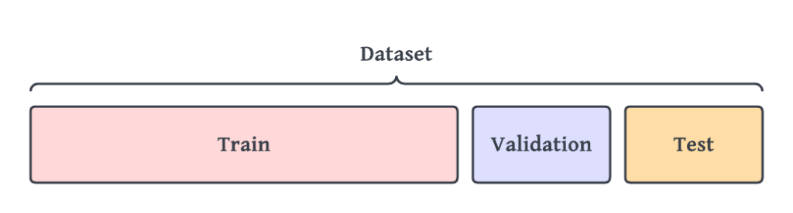
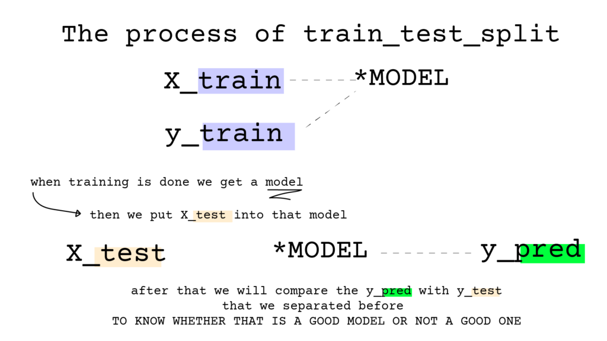

Imagine you are professor in a college and you want to conduct a exam for your students.

first of all, you give them some questions to work on to get ready for the exam, and then you conduct the real exam.

the questions that you give the students before the exam is what we call Training set, this training set usually take 80% of the dataset.

then there is what we call **Validation set**, this set is the one exam before the real exam to make sense of the model that we have learned or in our example, to find out what students are lacking in understanding and make changes according to the result they get on validation set and in Machine learning terms to change the hyper-parameters of the model.



the Real exam that you be put in a safe to prevent it from data leakage (explained later on) is called test set.

the job of Test set is only one thing, to take the learning that we had or the model that we trained and test it on a unknown data.

so we have generally 3 type of splits in Machine Learning:

* Training Set: the questions that the professor provide to learn about the subject
* Validation Set: to tune the hyper-parameters of our learning.
* Test Set: One final exam that we conduct, maybe they fail or maybe they pass that exam.

### What is Data Leakage ?

To simplify it, When Our model know about our test data, To continue with our example as being a professor, what it mean here is one of the students got to your house and stole the final exam from your safe box and shared it with all his classmates.


They may get high score on their Test, but they did not learned anything about the subject that you tried to teach them.

There is a way to prevent from data leakage and making your safe box more secure.

There is module in sci-kit learn to do this called train\_test\_split.

you can import it like this :

```
from sklearn.model_selection import train_test_split
```

before we can use this, we need to partition our data first into X and y. The y column that we separated is the column that we need to predict and The X is all the columns that gonna help us to predict the y column.

After that we pass X and y to train\_test\_split module, that module is gonna return four python variables. they are X\_train, X\_test, y\_train and y\_test

*you may notice that X is uppercased and y is lowercased this is just a convention that we use in ML pipelines*

### The process train\_test\_split explained

How all this four variables are used?



X\_train and y\_train are passed into our model to make that training happen, and they help the model to understand about our data.

then after when training is done, we pass X\_test to our model and look for the results at the output and we call that output of our model y\_pred, when we get our y\_pred we would compare it to our y\_test that we got from train\_test\_split.

to compare `y_pred` and y\_test, that comparison is dependent on the model that we choose to use. for example when we are talking about simple regression models, we use SSE (sum of square errors) to find out how well our model worked. and we can use y\_pred and y\_test to find out about other metrics in other models.

Train Test Split is A VERY Important part of ML pipeline that is done before preprocessing, some people would do preprocessing and then train test split, I'm not very fan of that approach, because it cause Data leakage ( In the future I want to talk about data leakage and how we can prevent it).

We need to find the normalization coefficients of the test set and after that we apply those coefficients onto your test set, you can imagine that if we keep do not train test split the test set data would change them coefficients and it is the definition of data leakage.
